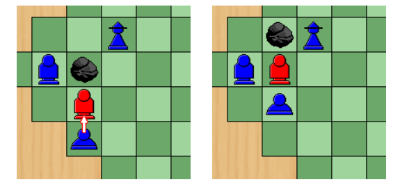
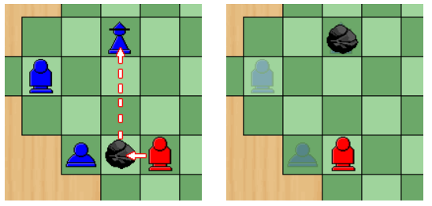
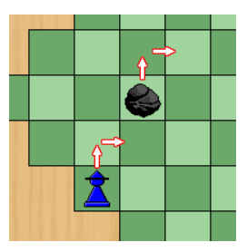
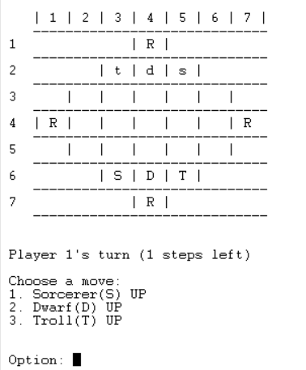
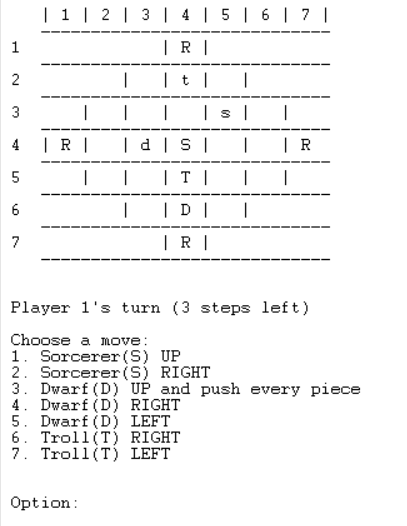
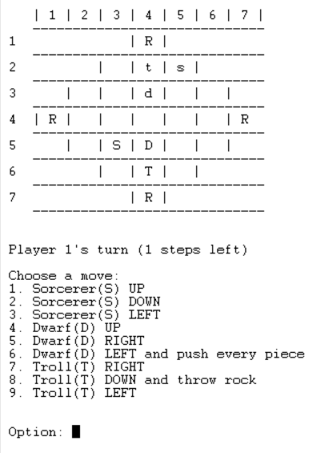

# Splut!

Grupo 'Splut_6':
- Adriano Alexandre dos Santos Machado (up202105352) - 50%
- Tomás Alexandre Soeiro Vicente (up202108717) - 50%

## Instalação and Execução

Para proceder à execução do Splut!, basta descomprimir a pasta compactada fornecida para um diretório de escolha. De seguida deve iniciar o SICStus Prolog 4.8 (caso não o tenha instalado siga as instruções neste [link](https://sicstus.sics.se/download4.html)). Uma vez iniciado deve consultar o ficheiro "main.pl" e invocar o predicado play/0.


```prolog=
? - consult('src/main.pl').
? - play.
```

## Descrição do Jogo

O jogo Splut! é um jogo de tabuleiro para dois a quatro jogadores. O objetivo do jogo é eliminar os *Sorcerers* adversários através do lançamento de pedras.

Em cada turno, o jogador pode mover as suas peças três vezes, com exceção do primeiro turno, no qual apenas é permitido um movimento, e do segundo turno, onde são permitidos dois movimentos.

No início, existem quatro pedras no tabuleiro, uma em cada canto, e cada jogador possui três peças (*Sorcerer*, *StoneTroll* e *Dwarf*).

Cada uma das três peças possui a capacidade de se deslocar para uma casa desocupada. Além disso, cada uma apresenta um conjunto de movimentos especiais.

### Dwarf

O *Dwarf* possui a capacidade de mover-se para uma casa já ocupada, desde que seja possível deslocar as peças adjacentes na direção desejada. Para isso, é necessário que exista uma casa vazia disponível no final do movimento para receber a peça deslocada.



### StoneTroll

O *StoneTroll* é uma peça com duas habilidades distintas: arrastar e atirar uma rocha.

####    Arrastar

Se exitir uma pedra adjacente no sentido oposto ao movimento, o *StoneTroll* pode escolher movimentá-la consigo.


####    Atirar

O StoneTroll tem a capacidade de deslocar-se para uma casa já ocupada por uma pedra e lançar a pedra numa determinada direção.

Essa ação termina imediatamente o turno do jogador. A pedra só é parada pela borda do tabuleiro, por uma pedra ou por um *StoneTroll*. Se a pedra colidir com um *Sorcerer*, o jogador que possuía essa peça perde o jogo.




### Sorcerer

Quando o Sorcerer se move, pode escolher levitar uma pedra qualquer na mesma direção que executa o seu movimento, desde que:

* A pedra escolhida não tenha sido movida no turno anterior por qualquer jogador.
* A casa para onde a pedra escolhida se vá mover esteja livre.
* O *Sorcerer* não deixou de levitar a pedra continuamente, ou seja, no mesmo turno não pode levitar, não levitar e querer voltar a levitar a pedra.



###    Fontes
As regras e o funcionamento do jogo foram consultadas nas páginas [IgGameCenter](https://www.iggamecenter.com/en/rules/splut) e [BoardGameGeek](https://boardgamegeek.com/boardgame/64735/splut/images).

## Lógica do Jogo

### Representação interna do estado de jogo

O estado de jogo, *GameState* é representado por uma lista de três elementos:

* **Board** - Matriz quadrada que representa o tabuleiro. Esta matriz é composta por diferentes elementos que simbolizam as peças do jogo. As peças pertencentes ao jogador um são representadas por letras maiúsculas, enquanto as peças do jogador dois são representadas por letras minúsculas. A letra "R" representa uma rocha, "T" ou "t" representam um StoneTroll, "D" ou "d" representam um Dwarf, e "S" ou "s" representam um Sorcerer. Além disso, devido ao formato de losango do nosso tabuleiro, os números -1 e -2 são usados para representar os limites do mesmo, sendo ambos tratados da mesma forma na lógica do jogo. O número -2 é particularmente útil na exibição do tabuleiro.

* **Turn** - Turno atual do jogo, é incrementado sempre que ocorre a mudança de jogador.

* **Steps** - Indica o número de jogadas restantes disponíveis para o jogador.

#### Exemplos de representação do GameState:

*   Estado Inicial

No início do jogo, as quatro pedras encontram-se dispostas nas extremidades do tabuleiro e as peças dos jogadores estão situadas em lados opostos. O jogo tem início com o primeiro turno, onde o primeiro jogador tem disponível um único movimento.


```prolog=
[[[-1,  -1,   -1,   'R',    -2,   -1,    -1],
 [-1,   -1,   't',  'd',   's',   -2,    -1],
 [-1,    0,    0,    0,      0,    0,    -2],
 ['R',   0,    0,    0,      0,    0,   'R'],
 [-1,    0,    0,    0,      0,    0,    -2],
 [-1,   -1,   'S',  'D',   'T',   -2,    -1],
 [-1,   -1,   -1,   'R',    -2,   -1,    -1]], 1, 1]
```

<br>

<br>
<br>

*   Estado Intermédio

```prolog=
[[[-1,  -1,   -1,  'R',  -2,   -1,   -1],
 [-1,   -1,    0,  't',   0,   -2,   -1],
 [-1,    0,    0,   0,   's',   0,   -2],
 ['R',   0,   'd', 'S',   0,    0,   'R'],
 [-1,    0,    0,  'T',   0,    0,   -2],
 [-1,   -1,    0,  'D',   0,   -2,   -1],
 [-1,   -1,   -1,  'R',  -2,   -1,   -1]], 12, 3]
```

<br>

<br>
<br>

*   Estado Final

No Splut! não é possível a ocorrência de empates pelo que o estado final só é atingido quando uma das pedras atinge o "Sorcerer" do jogador adversário. No seguinte exemplo o jogador dois foi o vencedor.


```prolog=
[[[-1,  -1,   -1,  't', -2,   -1,   -1],
 [-1,   -1,    0,   0,   0,   -2,   -1],
 [-1,    0,    0,   0,  's',   0,   -2],
 ['R',   0,   'd', 'R',  0,    0,   'R'],
 [-1,    0,   'T', 'D',  0,    0,   -2],
 [-1,   -1,    0,   0,   0,   -2,   -1],
 [-1,   -1,   -1,  'R', -2,   -1,   -1]], 13, 2]
```

<br>

<br>
<br>

### Visualização do estado de jogo

####    Menus

O nosso jogo tem três menus:

* Menu Principal: Neste menu, o utilizador tem a possibilidade de iniciar o jogo, consultar as regras do mesmo ou sair da aplicação.

* Seleção do Tamanho do Tabuleiro: Aqui, o utilizador pode optar por três tamanhos diferentes para o tabuleiro, nomeadamente, com sete, nove ou onze colunas.

* Escolha do Modo de Jogo: Este menu permite ao utilizador selecionar o modo de jogo desejado, com opções que incluem Jogador vs Jogador, Jogador vs Inteligência Artificial, Inteligência Artificial vs Jogador e Inteligência Artificial vs Inteligência Artificial.

Os três menus seguem uma estrutura comum, fundamentada nos seguintes predicados:

print_options(+MenuType) - Responsável por exibir as opções disponíveis no menu.

read_option(+Min, +Max, -Option) - Encarregado de receber um número dentro do intervalo especificado, compreendido entre Min e Max.

option(+MenuType, +Option) - Este predicado lida com a opção selecionada pelo utilizador, de acordo com o tipo de menu em questão.

```prolog=
menu(main) :-
    repeat,
    clear_screen,
    print_logo,
    print_options(main_menu),
    read_option(1, 3, Option),
    option(main_menu, Option).

option(main_menu, 1) :-
    menu(board_size, Size),
    menu(game_mode),
    initial_state(Size, GameState),
    display_game(GameState), !,
    game_loop(GameState, 1).

read_option(Min, Max, Option) :-
    repeat,
    write('\nOption: '),
    read_number(Option),
    (between(Min, Max, Option) ->  true ; write('Invalid option! Try again: '), fail).

```

####    Visualização do jogo

Embora a interface de utilizador restrinja as opções de tamanho de tabuleiro a três escolhas com o intuito de proporcionar uma experiência de utilização mais intuitiva, é importante notar que o nosso código, em particular o predicado "display_game(+GameState)", é flexível e capaz de acomodar tabuleiros de diversas dimensões.

O predicado "display_game(+GameState)" recebe o estado do jogo, determina as dimensões do tabuleiro e invoca um conjunto de predicados, nomeadamente o display_header, display_bar e display_board.

```prolog=
%display_game(+GameState)
display_game([Board, _, _]) :-
    clear_screen,
    length(Board, Length),
    display_header(Length),
    display_bar(Length),
    display_board(Board, 1, Length).
    
```

Dada a diversidade de escolhas no nosso jogo, optamos por tornar a interação com o utilizador mais fácil, apresentando-lhe uma lista das jogadas disponíveis. O utilizador, como demonstrado na imagem abaixo, seleciona a sua jogada a partir dessa lista.




### Validação e execução de jogadas

No nosso jogo, dividimos as jogadas possíveis em diferentes tipos "MoveTypes" :

* "emptySpace" - Qualquer peça tem a capacidade de mover-se para um espaço vazio.
* "trollPull" - O *StoneTroll* pode arrastar uma pedra atrás dele.
* "trollThrow" - O *StoneTroll* pode arremessar uma pedra numa direção específica.
* "dwarfPush" - O *Dwarf* pode empurrar todas as peças à sua frente.

O predicado responsável por atualizar o estado do jogo com base na jogada realizada é denominado move(+GameState, +Move, -NewBoard). O argumento "Move" é uma lista que contém as seguintes informações: [Peça, [X, Y], Direção, TipoDeMovimento]. 

A presença de diferentes tipos de movimento nos permitiu lidar de maneira mais simples com as diversas formas de movimentação, como exemplificado no exerto código a seguir.

```prolog=
move([Board, _ ,_], [Piece, [X,Y], Direction, emptySpace], NewBoard):-
    piece_map(Piece, PieceType),
    PieceType \= 'Sorcerer', !,
    direction_map(Direction, [Dx, Dy]),
    Nx is X + Dx, Ny is Y + Dy,
    set_piece(Board, [X,Y], 0, TempBoard),
    set_piece(TempBoard, [Nx, Ny], Piece, NewBoard), !.

move([Board, _ ,_], [Piece, [X,Y], Direction, dwarfPush], NewBoard):-
    shift_line(Board, [X,Y], Direction, NewBoard), !.
```

O utilizador só pode selecionar uma jogada a partir de um conjunto previamente calculado pelo nosso programa. Portanto, não é necessário realizar a validação antes da execução, uma vez que já foi feita anteriormente aquando do cálculo das jogadas possíveis, conforme será detalhado no próximo tópico.

### Lista de movimentos válidos

Para obter a lista de movimentos válidos, começamos por definir o predicado can_move(+Peça, +Tabuleiro, +Posição, +Direção, -TipoMovimento), no qual, se for possível mover uma determinada peça numa determinada direção, obtemos o tipo de movimento.

Por exemplo, se um StoneTroll puder movimentar-se para um espaço vazio e existir uma pedra adjacente no sentido oposto ao movimento, este pode escolher movê-la consigo através de um trollPull.

```prolog=
can_move('Troll', Board, [X, Y], Direction, trollPull) :-
    direction_map(Direction, [Dx, Dy]),
    Nx is X + Dx,
    Ny is Y + Dy,
    get_piece(Board, [Nx, Ny], Ocupied),
    Ocupied = 0,
    opposing_direction(Direction, OpposingDirection),
    direction_map(OpposingDirection, [ODx, ODy]),
    Ox is X + ODx,
    Oy is Y + ODy,
    get_piece(Board, [Ox, Oy], Ocupied2),
    Ocupied2 = 'R'.
```

O predicado valid_moves(+GameState, +Player, -ListOfMoves), começa por obter uma lista de todas as peças do jogador atual e, em seguida, chama o predicado get_moves(+Board, +PiecesList, +PiecesPosition, -ListOfMoves), que obtém a lista de todos os movimentos possíveis a partir de uma lista de peças.

```prolog=
valid_moves([Board,_, _], Player, ListOfMoves):-
    findall(Piece, belongs(Player, Piece), PlayerPieces),
    get_positions(Board, PlayerPieces, PiecesPosition),
    get_moves(Board, PlayerPieces, PiecesPosition, ListOfMoves).

get_moves(_, [], _, []).
get_moves(Board, [Piece | RestPieces], [[X, Y] | RestPositions], ListOfMoves):-
    Directions = ['UP', 'RIGHT', 'DOWN', 'LEFT'],
    findall([Piece, [X,Y], Direction, MoveType], 
            (member(Direction, Directions), piece_map(Piece, PieceType), can_move(PieceType, Board, [X, Y], Direction, MoveType)), 
            PieceMoves),
    get_moves(Board, RestPieces, RestPositions, RestMoves),
    append(PieceMoves, RestMoves, ListOfMoves).
```

### Fim de jogo

No Splut!, o jogo chega ao fim quando resta apenas um dos Sorcerers. Logo, verificar se o jogo terminou é uma bastante simples, como se pode constatar na definição do predicado "game_over(+GameState, -Winner)"

```prolog=

game_over([Board, _, _], Winner):-
    get_positions(Board, ['S'], Positions),
    Positions = [], !,
    Winner = 2.
game_over([Board, _, _], Winner):-
    get_positions(Board, ['s'], Positions),
    Positions = [], !,
    Winner = 1.
```

### Avaliação do estado do jogo

### Jogada do computador

## Conclusões


## Bibliografia

As regras e a descrição do jogo foram obtidas através da consulta das seguintes fontes:

1. iG Game Center. Splut Rules. https://www.iggamecenter.com/en/rules/splut
2. BoardGameGeek. Splut. https://boardgamegeek.com/boardgame/64735/splut/images
