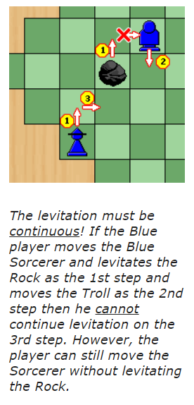

# Splut

## Trabalho por:
Grupo 'Splut_6':
- Adriano Alexandre dos Santos Machado (up202105352)
- Tomás Alexandre Soeiro Vicente (up202108717)

## Instalação and Execução
Para instalar a nossa versão desenvolvida do Splut, só é preciso descomprimir a pasta zipada fornecida para um diretório. <br> O jogo é executado, primeiro, consultando o ficheiro "main.pl" e logo, chamando o predicado play/0.

```prolog
? - play.
```

## Descrição do Jogo

'Splut', na sua versão original, é um jogo para 2-4 jogadores. Cada jogador, na sua vez, pode movimentar as suas peças 3 vezes (exceto no primeito turno do jogo, que só se pode fazer um movimento e no segundo turno, no qual só se podem fazer 2 movimentos). <br>
No tabuleiro existe 1 pedra em cada canto do tabuleiro e mais 3 tipos de peças, que cada jogador controla:
- 1 Sorcerer
- 1 StoneTroll
- 1 Dwarf
  
Estas peças podem-se mover para uma casa vazia adjacente ortogonalmente e cada uma tem as seguintes peculiaridades:

### Sorcerer

Quando o Sorcerer se move, pode escolher levitar uma pedra qualquer na mesma direção que executa o seu movimento, desde que:
1. A casa para onde a pedra escolhida se vá mover esteja livre
2. A pedra escolhida não tenha sido movida no turno anterior por qualquer peça
3. O Sorcerer não deixa de levitar a pedra continuamente. (Ou seja não para de levitar e volta a levitar mais tarde no turno do jogador)



### StoneTroll

O StoneTroll pode mover-se para uma casa ocupada por uma pedra, escolhendo então uma direção para a poder atirar. A pedra só para quando bate na borda do tabuleiro, noutra pedra ou noutro StoneTroll, parando na casa antes. Caso embata num Sorcerer, este é esmagado "Splut!" e o jogador que possuia esse Sorcerer perde. A pedra passa por cima do Dwarf, no entanto, se a pedra parar numa casa ocupada por um Dwarf, este é esmagado e sai do jogo. Quando uma pedra é lançada, o turno termina.

O StoneTroll pode também puxar uma pedra, caso esteja adjacente a uma e decide andar para a casa oposta à pedra. 


### Dwarf

<!-- Condição de ganhar o jogo-->

## Lógica do Jogo